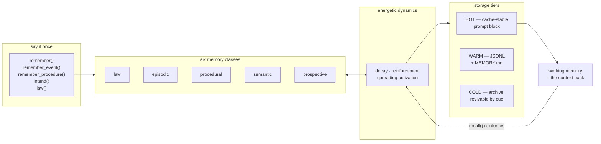

<div align="center">

# 🐕 WOUF

### **W**rite **O**nce, **U**se **F**orever

*An energetic memory system for LLM agents — say it once, and the model never needs it repeated.*


<sub>Live recording of the real library — regenerate with [`vhs docs/demo/demo.tape`](docs/demo/demo.tape), or grab the [MP4](https://github.com/mjgleason3/wouf/releases/download/v0.1.0/demo.mp4).</sub>

</div>

LLM agents forget. Keeping everything in the prompt gets expensive and silently truncates; notes-in-files have no ranking or lifecycle; vector RAG is stateless — nothing strengthens, nothing fades, contradictions pile up. WOUF treats memory the way brains do: as an **energetic system** where memories carry strength, *use* reinforces, *disuse* decays, and related memories pull each other into focus. And it adds one insight unique to LLMs: **order context by mutation rate, so the prompt prefix stays stable and the KV cache keeps paying for it.**

On a 30-session benchmark against the two default strategies (details below):

| | 🐕 WOUF | full-context | flat-files |
|---|---:|---:|---:|
| Times the user had to **repeat themselves** | **0** | 12 | 11 |
| Probe recall (needed memory was in context) | **1.00** | 0.29 | 0.36 |
| Effective context tokens / session¹ | **131** | 384 | 8² |

¹ after prompt-cache discount &nbsp;&nbsp;² cheap because it retrieves almost nothing — it misses 64% of probes

---

## How it works



Six classes, one lifecycle — all share the same decay physics, differing in payload and initial stability:

| Class | Holds | Behavior |
|---|---|---|
| ⚖️ **Law** | cross-domain tendencies | fallback priors for novel situations; confidence-weighted, fallible, in tension |
| 🕐 **Episodic** | timestamped events | sparse focus — only a salient subset in context per session |
| 🔧 **Procedural** | multi-step processes | versioned; corrections supersede, history preserved via `refines` edges |
| 💡 **Semantic** | concise facts | slow decay; contradictions detected and demoted on write |
| 🎯 **Prospective** | trigger → action intentions | fire into context when a session matches the trigger |
| ⚡ **Working** | current attention set | ephemeral — it *is* the token-budgeted context pack |

A typed graph (`depends_on`, `refines`, `contradicts`, `about`, `triggers`, `tension`) connects memories across classes, so recalling the deploy procedure also surfaces the credentials fact it depends on — even with zero keyword overlap.

## Laws — priors for unmapped territory

Drop someone into a forest they've never seen, with no map — they still know water flows downhill, so they head for the valley. **Laws** are that top layer of memory: cross-domain tendencies (gravity, entropy, *"prefer the reversible action"*) that are *almost always* true and therefore most valuable exactly when nothing specific applies. WOUF gates them **inversely**: recall measures how much of the query is covered by specific memory — strong coverage keeps laws out of the pack, weak coverage (unmapped territory) pulls in the top-confidence laws as guidance.

```text
## Guiding laws
- Water flows downhill [95%]
- When uncertain, prefer the action that is easiest to undo [90%]
    in tension with: "Strike while the window of opportunity is open"
- Moss favors the shaded side of trees [68%]
    exception: dense canopy: moss grew on every side
```

The nuance is first-class: laws are **fallible** (`confidence` rides along, managed by `confirm()` / `refute()`, with refutations recording exceptions that render beneath the law), and they **conflict** (declared `tension` edges are surfaced to the model, never silently arbitrated). Confidence is separate from stability on purpose — stability is how *memorable* a law is, confidence is how *true* it has proven. Refuted below 0.35, a law is **repealed**: archived as history, never deleted.

## The physics

Every memory has **stability** *S* (long-term strength, in days) and **activation** *A* (short-term energy). Retrievability follows the Ebbinghaus curve, and every use strengthens:

```text
R = exp(−Δt / S)                      # forgetting curve
S ← S × (1 + α·(1−R))   on use       # spacing effect: rescuing a fading
                                      #   memory teaches the most
```

<picture>
  <source media="(prefers-color-scheme: dark)" srcset="docs/assets/decay_dark.svg">
  
</picture>

Memories that fade below threshold aren't deleted — they're compressed into a **COLD archive** and revive on a strong cue (*"what did Sam and I discuss over coffee?"* — even months later). Write once, **use forever**.

## The cache trick

The rendered memory block is deterministic: **stability selects, arrival orders.** Long-lived memories fill the front of the block and new churn appends at the back — so the prompt prefix barely changes between sessions, which is exactly what prompt caches bill ~90% less for. In the benchmark, WOUF's standing block kept a **0.76 stable-prefix ratio** between sessions (vs 0.32 for a sliding window), cutting effective context cost to about a third.

## Benchmark

Thirty simulated assistant sessions across 45 virtual days: facts stated **once**, procedures taught then corrected mid-stream, laws stated on day 0, daily noise accruing, and 14 probe queries checking whether the memory each answer *needs* is actually in context — including two novel-situation probes ("failing in a way nobody has seen before, where do I start?") that only law fallback can answer. Same 600-token budget for all three systems. Every miss forces the user to repeat themselves — the failure WOUF is named after.

<picture>
  <source media="(prefers-color-scheme: dark)" srcset="docs/assets/quality_dark.svg">
  
</picture>

<picture>
  <source media="(prefers-color-scheme: dark)" srcset="docs/assets/tokens_dark.svg">
  
</picture>

<picture>
  <source media="(prefers-color-scheme: dark)" srcset="docs/assets/cost_dark.svg">
  
</picture>

Reproduce every number and chart (fixed seed, no API keys):

```bash
python -m benchmarks.run     # metrics table + benchmarks/out/results.json
python -m benchmarks.charts  # regenerates docs/assets/*.svg
```

## Quickstart

```bash
git clone https://github.com/mjgleason3/wouf.git && cd wouf
pip install -e .             # pure stdlib — no dependencies
```

```python
from wouf import Wouf
import time

w = Wouf(".wouf")            # WARM layer: human-readable JSONL + MEMORY.md
now = time.time()

# say it once
w.remember("My daughter's name is Ada", now=now)
w.remember_procedure("deploy-api",
    ["run tests", "build image", "run smoke tests", "apply manifests"], now=now)
w.intend(trigger="deploy", action="update the changelog first", now=now)
w.law("When uncertain, prefer the action that is easiest to undo", now=now)

# ...weeks later, in any session:
pack = w.recall("time to deploy", now=time.time(), budget=800)
print(pack.markdown)          # → paste into the prompt; recall reinforces

print(w.standing_block(now))  # → cache-stable preamble to pin in the system prompt
w.tick(now); w.save()         # decay pass + persist
```

`ContextPack.markdown` is the integration seam for any agent framework — WOUF never calls a model itself.

## Wiring it into your agent

WOUF plugs into any LLM harness at **three seams** — where the prompt is built, where each turn is answered, and where new information gets written back:

```text
                 session start                every turn                    write path
              ┌────────────────┐        ┌──────────────────────┐    ┌─────────────────────────┐
your harness  │ w.tick(now)    │        │ pack = w.recall(msg) │    │ w.remember(...)         │
              │ standing_block │───┐    │ inject pack into the │    │ w.remember_procedure()  │
              └────────────────┘   │    │ user turn            │    │ w.intend() / w.law()    │
                                   ▼    └──────────────────────┘    │ w.correct() on feedback │
              system prompt  [persona | STANDING BLOCK ⚓cache]      └─────────────────────────┘
              user turn      [<memory> recall pack </memory> + message]
```

1. **Session start** — `tick(now)` runs the decay pass, then `standing_block()` goes into the **system prompt behind a prompt-cache breakpoint**. The block is deterministic and appends new memories at the back, so it stays byte-identical between turns — a prefix-matching cache (like the Claude API's `cache_control`) serves it at ~10% cost from the second request on.
2. **Every turn** — `recall(user_message)` builds the query-driven pack; wrap it in a `<memory>` tag inside the user turn, *after* the cached prefix. Recall reinforces what it surfaces, which is what closes the energetic loop.
3. **Write path** — your harness calls `remember()` / `law()` / `intend()` / `correct()` when the user states something durable. Two common styles: explicit commands (`/remember ...`), or exposing these methods as **tools** in an LLM tool-use loop so the model decides what's worth keeping. WOUF is storage, retrieval, and lifecycle — extraction policy stays yours.

The distilled loop (Anthropic SDK shown; any provider works the same way):

```python
system = [
    {"type": "text", "text": PERSONA},
    {"type": "text", "text": w.standing_block(now=now, budget=600),
     "cache_control": {"type": "ephemeral"}},          # cache-stable by design
]
pack = w.recall(user_message, now=now, budget=400)
response = client.messages.create(
    model="claude-opus-5", max_tokens=1024, system=system,
    messages=[{"role": "user",
               "content": f"<memory>\n{pack.markdown}\n</memory>\n\n{user_message}"}],
)
```

[`examples/05_agent_integration.py`](examples/05_agent_integration.py) is the runnable version — offline by default (a deterministic stand-in model shows exactly which memories reached the prompt), and `--live` runs the same loop against the Claude API and prints the cache read/write counters so you can watch the standing block get served from cache.

## Examples

| Script | What it shows |
|---|---|
| [`examples/01_personal_assistant.py`](examples/01_personal_assistant.py) | facts stated Monday, still in context three weeks later; an intention firing on "time to deploy" |
| [`examples/02_procedural_learning.py`](examples/02_procedural_learning.py) | a deploy fails → one correction → v2 supersedes, v1 preserved but never recalled |
| [`examples/03_decay_and_revival.py`](examples/03_decay_and_revival.py) | rehearsed vs ignored memories, archival, and revival by cue |
| [`examples/04_laws.py`](examples/04_laws.py) | laws stepping in on novel ground, staying out on familiar ground, tension and refutation |
| [`examples/05_agent_integration.py`](examples/05_agent_integration.py) | the full agent loop — standing block, per-turn recall, write path; offline or `--live` against the Claude API |

```text
 day   rehearsed fact   ignored event
   0     1.00 (S=30d)            1.00
  10     1.00 (S=35d)            0.24      ← recall boosted stability
  20     1.00 (S=40d)            0.06
  25     0.88 (S=40d)        archived      ← nothing is deleted
                                             ...day 40: revived by cue
```

## Project layout

```text
wouf/          the package — models, dynamics, graph, relevance, recall, render, store, facade
tests/         37 tests: physics, recall pipeline, laws, lifecycle, persistence, cache stability
benchmarks/    the 30-session scenario, 3 systems, metrics + chart generation
examples/      four runnable demos
docs/SPEC.md   the full design specification
```

Design details — the recall scoring formula, tiering thresholds, edge semantics, benchmark protocol — live in **[docs/SPEC.md](docs/SPEC.md)**.

## Credits & related work

WOUF is a synthesis, and the load-bearing ideas have long paper trails. What each one contributed:

**Cognitive science foundations**
- Ebbinghaus (1885), *Über das Gedächtnis* — the exponential forgetting curve behind `R = exp(−Δt/S)`.
- Tulving (1972), *Episodic and semantic memory* — the episodic/semantic distinction the class taxonomy starts from.
- Collins & Loftus (1975), *A spreading-activation theory of semantic processing* — recall pumping energy into graph neighbors.
- Anderson & Schooler (1991), *Reflections of the environment in memory*, and the ACT-R declarative memory model (Anderson et al., 2004) — need-based activation from recency and frequency of use; the closest ancestor of WOUF's stability/activation split.
- Einstein & McDaniel's prospective-memory research — cue-triggered future intentions, the model for `intend()`.
- Lake, Ullman, Tenenbaum & Gershman (2017), [*Building Machines That Learn and Think Like People*](https://arxiv.org/abs/1604.00289) — intuitive-physics priors that transfer to novel situations; the inspiration for the Laws layer.

**Spaced repetition**
- Wozniak & Gorzelanczyk (1994), *Optimization of repetition spacing in the practice of learning* (the SuperMemo line), and [FSRS](https://github.com/open-spaced-repetition) — Ye, Su & Cao (KDD '22), *A Stochastic Shortest Path Algorithm for Optimizing Spaced Repetition Scheduling* — the stability/retrievability formulation and the spacing effect in `S ← S × (1 + α·(1−R))`.

**Memory for LLM agents**
- Park et al. (2023), [*Generative Agents*](https://arxiv.org/abs/2304.03442) — scoring memories by recency × importance × relevance.
- Packer et al. (2023), [*MemGPT*](https://arxiv.org/abs/2310.08560) — tiered memory with an OS paging metaphor; kin to HOT/WARM/COLD.
- Zhong et al. (2023), [*MemoryBank*](https://arxiv.org/abs/2305.10250) — applying the Ebbinghaus curve to LLM memory decay.
- Sumers, Yao, Narasimhan & Griffiths (2023), [*Cognitive Architectures for Language Agents*](https://arxiv.org/abs/2309.02427) — the episodic/semantic/procedural taxonomy for agents that WOUF's classes align with.
- Gutiérrez et al. (2024), [*HippoRAG*](https://arxiv.org/abs/2405.14831) — hippocampal-indexing-inspired retrieval over a memory graph.
- Xu et al. (2025), [*A-MEM: Agentic Memory for LLM Agents*](https://arxiv.org/abs/2502.12110) — dynamically linked memory notes, Zettelkasten-style.

**The cache angle**
- Gim et al. (2023), [*Prompt Cache: Modular Attention Reuse for Low-Latency Inference*](https://arxiv.org/abs/2311.04934) — attention-state reuse across prompts; together with production prefix caching (e.g. [Anthropic's prompt caching](https://platform.claude.com/docs/en/build-with-claude/prompt-caching)), the reason WOUF orders context by mutation rate.

WOUF's particular mix — one lifecycle across six classes, confidence-carrying laws with inverse novelty gating, and cache-stable rendering as a first-class design goal — is its own, but it stands on all of the above.

## License

MIT
